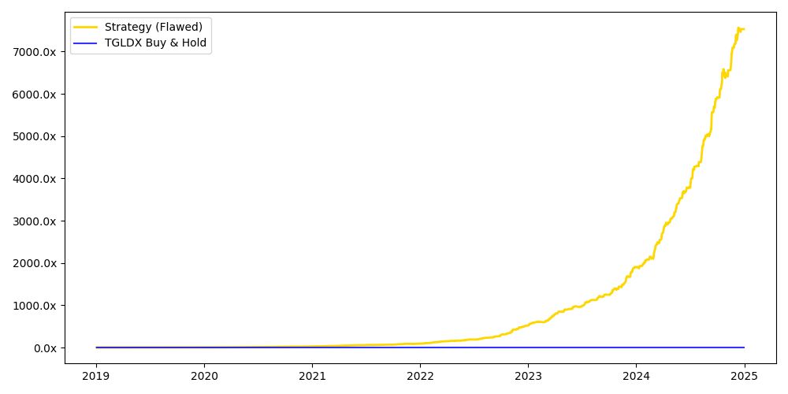
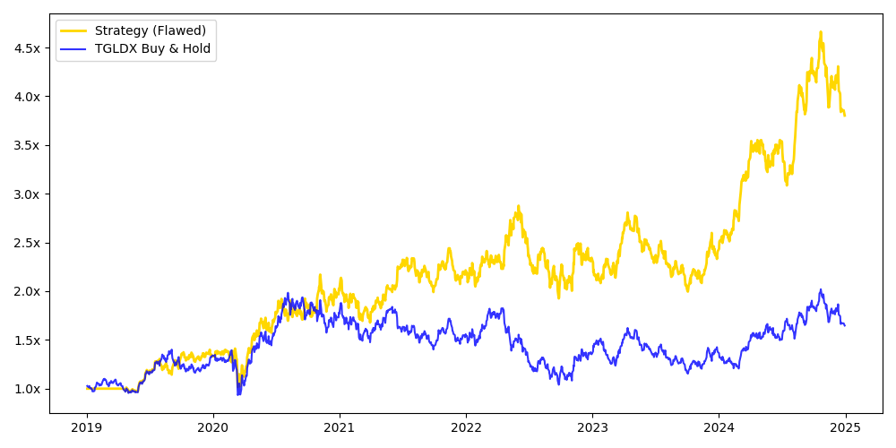

# Quantitative Finance Experiments
Collection of experiments exploring trading strategies, backtesting pitfalls, and the gap between theoretical performance and real-world execution. These experiments are designed to expose limitations in naive backtesting and highlight the importance of execution realism.

## Projects

### 1. Gold Lookahead Strategy

**What it Does:**  
Backtests a signal-based trading strategy on gold ETFs and demonstrates how improper data handling can produce unrealistically high returns.

**Core Idea:**  
Impact of lookahead bias on backtesting results.

**Approach:**  
	•	Generate trading signals based on price data  
	•	Execute trades using the same day’s price (biased setup)  
	•	Compare with a corrected implementation using only available information  

**How it Works:**  
In the initial model, the strategy uses the current day’s price to generate and execute trades, introducing lookahead bias. This allows the model to act on information that would not have been available in real time. When corrected to execute trades using only prior data, performance drops sharply, revealing the illusion.

**Results:**  
	•	Biased strategy: 344.5% CAGR  
	•	Buy & hold (TGLDX): 8.7% CAGR  
	•	Corrected strategy: Underperforms buy & hold  

**Key Insight:**  
Small violations of causality in backtesting can completely invalidate results.

**Stack:** Python, NumPy, yfinance, Matplotlib, Pandas

### 2. Gold Mean-Reversion Strategy

**What it Does:**  
Tests a mean-reversion strategy on the price ratio of gold ETFs and evaluates its practical limitations.

**Core Idea:**  
Limits of mean-reversion assumptions in financial markets.

**Approach:**  
	•	Compute the GLD/TGLDX price ratio  
	•	Calculate a 60-day rolling z-score  
	•	Enter positions when the ratio deviates significantly from its mean  
	•	Exit when the ratio normalizes  

**How it Works:**  
The strategy assumes that deviations in the price ratio will revert to the mean. However, the ratio exhibits long periods of divergence, violating this assumption. Additionally, implementing the strategy would require shorting TGLDX, which is not practically feasible.

**Results:**  
	•	Strategy: 25.0% CAGR  
	•	Buy & hold (TGLDX): 8.7% CAGR  

**Key Insight:**  
A strategy can appear statistically valid while being structurally or operationally infeasible.

**Stack:** Python, NumPy, yfinance, Matplotlib, Pandas

